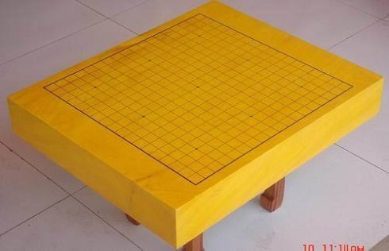
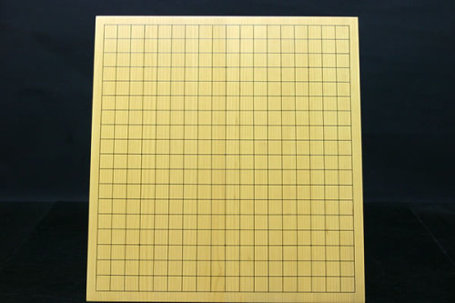
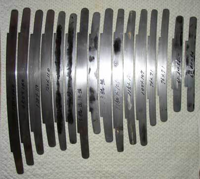
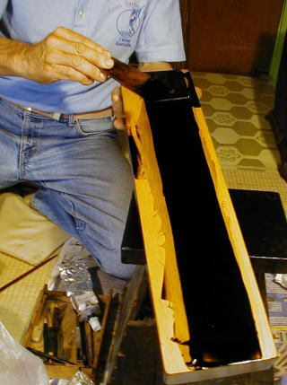
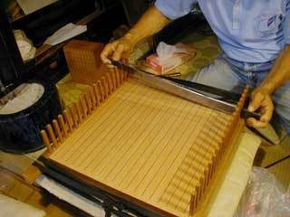

# 日本围棋 棋盘篇二：鬼斧神工（中）_钱进_新浪博客

----

棋盘经过细刨、开血馏之后，就成了成型的盘坯，下一步是打漆。日本的漆目前用的是印度漆片，把漆片化开，薄薄的打上一层，可不是向国内那样用刷子刷，而是用一个类似拓片的墩子一点点擦上，擦完之后基本保持木材原色，而且不怕水，绝不是国内那种黄澄澄的金色。对比一下国内的榧盘与日本榧盘。

（国内某厂家的榧木盘，色浮，且必定干燥不够时间，日后会发红）

（日本榧木盘，森森然，庄重肃穆）

上漆之后是划线，我必须说明，划线不是刻线，国内的一些商家不知道从哪里听到了军刀刻线，便独出心裁的用刀子刻棋盘，把好好的一块木料弄得伤痕累累，啊！我看着都心疼，看来再穷不能穷教育啊！

下面我澄清一下所谓的军刀刻线，首先，世界上从来没有军刀刻线一说，就像从来没有救世主一样，所谓的军刀其实是外行看到日本的棋盘师在用特制的钢片压线。

（日本的棋盘线钢压片，就是国内误解的“军刀”）

日本的棋盘线画法多样，有用鼠须笔画的，更多的是用钢片压线，日本的棋盘线漆料是用特制树脂调成。配方有划线师傅保留，是一种秘方，不会外传。划线的钢片多种多样，长短不一，有的是为了适应不同大小的棋盘，如13路棋盘，9路棋盘，一般都是划大棋盘用的长钢条。

划线之前棋盘师傅会把棋盘用界尺分好区域，也有用纸条贴边的，总之划线要有一个参照，之后用钢片边缘蘸着树脂一道一道的压在上面，画完横线，干燥24小时以后再画竖线，之后点上星、天元。

树脂干燥后由于张力会鼓出盘面，这也就是日本棋盘线都鼓出来的原因，这种做法的好处是棋子不是直接打在盘上，而是先打在线上，可以很好的保护棋盘，大不了几年后再重新划线。相比之下，国内刻线的方法一定让日本棋盘师傅气歪了鼻子。

## 转载来源

* [日本围棋 棋盘篇二：鬼斧神工（中）_钱进_新浪博客](http://blog.sina.com.cn/s/blog_4c2a39510100hdv6.html)
