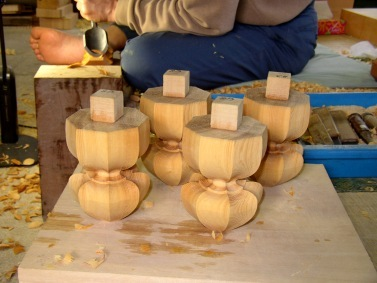
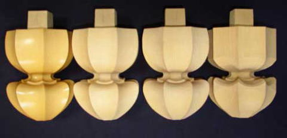
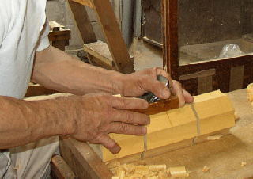
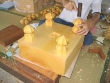

# 日本围棋 棋盘篇二：鬼斧神工（下）

----

棋盘完工之后要安装腿，由于腿部的木材较小，所以干燥期较短，但是棋墩的腿部制作一点也不比棋盘的制作省事，日本匠人师傅的精益求精，使得腿部的制作也成为了一种艺术。

据说，日本棋墩的腿部是一种含苞待放的花朵，其寓意是提醒人们观棋要安静，好像静静的花苞。

制作棋盘腿的工具是一种特殊的弧形凿子，因为日本棋盘的腿基本都是由流畅的弧线构成，看不到一条直挺挺的硬线。另外还要说明的是，棋盘腿都是一对一对制作的。首先由棋盘师傅在腿料上划线，然后用锯子锯出需要剔出的部分。

之后棋盘师傅会一点一点地剔出多余部分，成为棋盘腿的雏形，经过细细的打磨，可以成为优美的棋盘腿，之后需要泡在水里，因为棋盘腿的木材料较小，因此可以采用水浸法干燥。

干燥之后的棋盘腿经过上漆，就是现在的模样。最后一步就是钉上棋盘，一般来说，厚棋墩的棋盘腿较为矮胖，薄棋墩的腿较为细长，主要是为了协调的缘故。

至此，一个完美的棋盘就制造完成了

## 转载来源

* [日本围棋   棋盘篇二：鬼斧神工（下）_钱进_新浪博客](http://blog.sina.com.cn/s/blog_4c2a39510100hdva.html)
